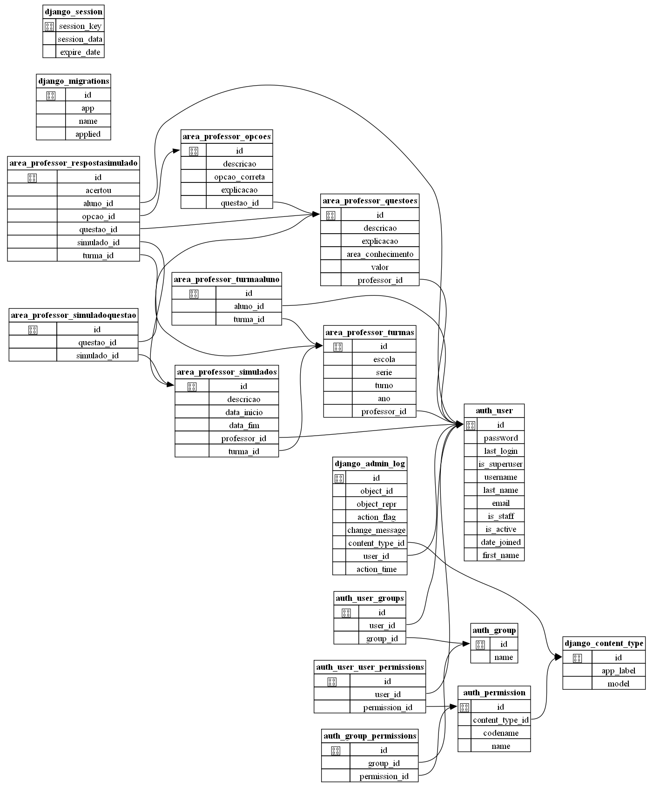

# App To Bem To Zen

## História

Professores que preparam alunos para o Enem enfrentam o desafio de criar e corrigir uma grande quantidade de simulados. 
Além disso, acompanhar o progresso individual de cada aluno e gerar relatórios detalhados sobre o desempenho da turma exige muito tempo e esforço.

Nossa plataforma oferece uma solução completa para esses desafios. Professores podem facilmente criar simulados personalizados, com diversos tipos de questões, e associá-los às suas turmas. O sistema corrige as provas automaticamente, gerando relatórios detalhados sobre o desempenho de cada aluno e da turma como um todo. Alunos, por sua vez, têm acesso a uma variedade de simulados, podem acompanhar seu próprio progresso e competir com seus colegas em rankings personalizados. A plataforma também oferece recursos de gamificação para tornar o estudo mais divertido e engajador.

### Requisitos
* Área do Professor
    * Criação e Gestão de Simulados: 
        * Criar novos simulados com questões de múltipla escolha, discursivas e por imagem.
        * Definir o nível de dificuldade, tempo de prova e assuntos abordados.
        * Associar simulados a turmas específicas.
        * Gerenciar um banco de questões para reutilizar em diferentes simulados.
    * Geração de Relatórios:
        * Gerar relatórios individuais e por turma, mostrando o desempenho dos alunos em cada questão e no simulado como um todo.
        * Identificar os pontos fortes e fracos dos alunos.
        * Comparar o desempenho da turma com médias nacionais ou estaduais (se houver dados disponíveis).
    * Comunicação:
        * Enviar mensagens aos alunos com instruções e feedback sobre os simulados.
        * Criar fóruns de discussão para tirar dúvidas e promover a interação entre os alunos.
* Área do Aluno
    * Acesso aos Simulados:
        * Realizar simulados atribuídos pelo professor.
        * Acessar simulados públicos disponíveis na plataforma.
        * Revisar as respostas e o gabarito após a realização do simulado.
    * Acompanhamento do Desempenho:
        * Visualizar o histórico de resultados em todos os simulados realizados.
        * Comparar o próprio desempenho com a média da turma.
        * Identificar os assuntos que precisam de mais estudo.
    * Recursos de Estudo:
        * Acessar materiais de estudo relacionados aos simulados, como videoaulas e exercícios complementares.
        * Participar de fóruns de discussão para tirar dúvidas com outros alunos e professores.

Além dessas funcionalidades básicas, podemos considerar recursos adicionais para enriquecer a experiência do usuário:

* Gamificação:
    * Pontuação e rankings para incentivar a participação dos alunos.
    * Badges e conquistas para reconhecer o progresso.
* Personalização:
    * Permitir que os alunos escolham os assuntos que desejam estudar.
    * Criar planos de estudo personalizados com base no desempenho.
* Inteligência Artificial:
    * Utilizar algoritmos de IA para gerar questões personalizadas e identificar padrões de erro nos alunos.

### Modelagem

`Gerada automáticamente - ver docs/generate_diagram.bat`

### Entidades

As entidades são gerenciadas pelos grupos!

* Adminstradores
* Professores
* Alunos